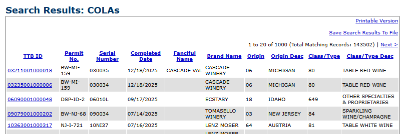

# TTB Label Verification — Prototype

I built a tool that checks whether an alcohol beverage **label image** matches the
details filed in its **application** (brand name, class/type, ABV, net contents,
bottler/origin, and the mandatory Government Health Warning).

I designed it to help a compliance agent get through routine matching quickly,
while leaving the judgment calls to the human. It is **not** an auto-approver —
and as I explain below, that's a deliberate legal stance, not just a UX choice.

> **Live demo:** https://ttb-label-verifier-dnn7.onrender.com
> URL. The app is deployed and publicly reachable, and a single label check
> comes back in **under five seconds**.

---

## Quick start for Developer -not hosted

You'll need **Python 3.9+** and the **Tesseract OCR engine** (a one-time system
install; everything else is pip).

**1. Install Tesseract**

| OS | Command |
|----|---------|
| macOS | `brew install tesseract` |
| Ubuntu/Debian | `sudo apt-get install tesseract-ocr` |
| Windows | Install from the [UB-Mannheim build](https://github.com/UB-Mannheim/tesseract/wiki) and make sure `tesseract.exe` is on your PATH |

**2. Install Python dependencies**

```bash
python -m venv .venv
source .venv/bin/activate        # Windows: .venv\Scripts\activate
pip install -r requirements.txt
```

**3. Generate the sample test labels**

```bash
python scripts/generate_test_labels.py
```

This writes the sample labels to `sample_data/` plus a `sample_manifest.csv` for
batch mode. I made the set span distilled spirits, wine, and malt beverages, and
deliberately covered the cases I thought mattered most:

- compliance edge cases — a title-case warning heading instead of all-caps,
  altered or missing warning wording, and a heading that is all-caps but **not
  bold** (the wording, the capitalization, *and* the bold weight all have to be
  right); plus wrong ABV, a brand casing/punctuation variant ("STONE'S THROW" vs
  "Stone's Throw"), proof-vs-ABV inconsistency, `&` vs `AND` in a brand name, and
  a "100% de Agave" label (which must not be misread as 0% ABV);
- domestic vs imported — a single **Origin** field holds either a US **state**
  (with abbreviation vs. full-name matching, e.g. label "KY" / filed "Kentucky")
  or a **country** (e.g. "Product of Mexico"); a product is one or the other,
  never both. This matched what I saw in the
  [COLA Registry](https://ttbonline.gov/colasonline/publicSearchColasBasicProcess.do?action=search):

  

- "bad photo" conditions — glare, low light, blur, slight rotation, and sensor
  noise — so you can see the tool read through imperfections. This includes a
  blurry/dark vodka label that **still reads correctly** (the OCR escalates its
  sharpening when a first pass reads poorly), a couple of **bad photos that also
  carry wrong information** (a blurry wine whose filed ABV doesn't match the
  label, a glare-hit beer whose filed brand is wrong) so you can confirm errors
  are still caught on imperfect scans, and one **genuinely too-degraded** label
  that trips the image-quality flag.

The manifest includes an `expected_outcome` column describing what each label
should do (the app ignores unknown columns).

> **On TTB's Public COLA Registry:** the registry has real approved label images,
> and I tried to replicate the spirit of how applications are submitted and
> reviewed there — while using OCR to read the label images faster than a person
> could by hand.
> [Public COLA Registry search](https://ttbonline.gov/colasonline/publicSearchColasBasic.do)

**4. Run the app**

```bash
uvicorn backend.main:app --reload --port 8000
```

Open **http://localhost:8000** in a browser.

> Tip: visit `http://localhost:8000/api/health` to confirm the OCR engine is
> detected. If Tesseract isn't installed, this endpoint and the UI banner will
> tell you exactly how to fix it.

---

## How to use it

**Check one label.** Type the filed application values (all fields are required,
except **alcohol content for wine and beer** — when the class/type contains
"wine" or a beer/malt term like "ale", "lager", or "IPA", the ABV field becomes
optional and the form shows a note about the 0.5% ABV threshold). Drop in the
label photo, and click **Check this label**. You get an overall verdict plus a
per-field breakdown, and you can expand "what the scanner read" to see the raw
OCR text.

**Batch check.** For importers that submit hundreds of labels at once: upload a
manifest CSV (one row per label) and all the image files. Rows are matched to
images by filename. Results are listed worst-first so problem labels surface
immediately. A sample manifest is downloadable from inside the app.

Each check returns one of these verdicts:

- **All checks passed** — every checked field matches.
- **Review recommended** — something needs a human glance (a fuzzy name match, a
  proof inconsistency, or a warning whose bold formatting can't be confirmed).
- **Needs attention** *(orange)* — a discrepancy on a **low-quality** photo. The
  image needed heavy enhancement to read, so OCR may be wrong; a human should
  look before deciding.
- **Rejected** *(red)* — a definitive fail: a discrepancy on a **clear,
  high-quality** photo (the label genuinely doesn't match), a field the reviewer
  **marked incorrect**, or an image the reviewer flagged **too low quality to
  read**.

I split *needs attention* from *rejected* as a triage decision: a clear photo
that doesn't match is a confident rejection, while a discrepancy on a poor photo
is held for human review rather than auto-failed.

**Reviewer decisions.** The tool assists; the agent decides. The reviewer can
act on an item in two situations: when the photo is flagged **low quality** (it
needed heavy enhancement to read, so OCR may be unreliable), or when an item is
**Review recommended** (a genuinely ambiguous call — like a fuzzy name match, or
a proof that doesn't line up with the stated alcohol content, e.g. 45% ABV
labeled as 80 proof when it should be 90). In those cases each item offers two
choices — **Confirm correct** or **Mark incorrect** — so the reviewer can either
clear it or lock it in as a real problem. On a low-quality photo the reviewer
also gets two whole-label actions: **confirm the label is correct** (vouch for
everything at once), or **the image is too low quality to read**, which rejects
the label outright with a distinct **Rejected — image unreadable** verdict so it
gets sent back for a better photo. Any decision can be undone.

The verdict recomputes live from these decisions: confirming clears an item,
marking anything incorrect drives the label to **Rejected** (even on a
low-quality photo), and confirming everything yields **Confirmed by reviewer**.
Crucially, a hard mismatch or missing element on a **clear, high-quality photo
offers no actions** — that's a real finding, so it's **Rejected** outright with
no buttons (e.g. a wrong filed ABV on a sharp label). The **batch** tab follows
the identical rules, with decisions tracked independently per row.

---

## Approach & key decisions

I let the constraints from the discovery interviews drive the design. The
interesting engineering here is in *respecting* those constraints, not just
reading a label.

**Assist, don't replace — and I treat that as a legal stance, not just a UX
choice.** My experience as a tech consultant, making decisions that affect global
companies, drove home a lesson that shaped this whole project: when AI is in the
loop, a human has to make the final decision. AI is a fantastic tool, but it
needs human interaction — and from a liability standpoint, the person who builds
the model shouldn't be the one on the hook for an approval. Keeping a qualified
agent as the decision-maker is what keeps the responsibility where it legally
belongs. So I designed this to *assist*, never to auto-approve. Confident matches
pass, but anything ambiguous is surfaced as "review" with a plain-language
reason; the raw OCR text is always one click away for the agent to verify; and
the final call — confirm, mark incorrect, reject — is always a human action the
tool records rather than makes on its own. The model flags and explains; the
person decides and is accountable.

**On-prem OCR, not a cloud vision API.** IT was explicit that the agency network
blocks outbound traffic to ML endpoints, and that the previous vendor's cloud
features broke because of it. So I made the default OCR engine **local
Tesseract**, which runs entirely on-prem with **zero outbound calls**. I also
used **no CDN fonts or libraries** in the frontend for the same reason. I put OCR
behind a small provider interface (`backend/ocr.py`), so a more capable engine —
a self-hosted vision model, say — can be dropped in later without touching the
matching logic.

**Two matching strategies, because the fields aren't alike.**
- The **Government Warning** I match *exactly* (`backend/warning.py`):
  whitespace-normalized but case-sensitive, and I specifically check that
  "GOVERNMENT WARNING" appears in capitals. This catches the real-world evasions
  agents described — title-case headings, altered wording, missing sentences.
  The required **bold** type on the heading I verify from the pixels
  (`backend/formatting.py`): bold glyphs have measurably thicker strokes, so the
  tool compares the heading's stroke width against the warning's body text and
  flags a heading that is correctly capitalized but not bold.
- **Brand name, class/type, etc.** use *normalized fuzzy* matching
  (`backend/fuzzy.py`): I strip case and punctuation before comparison, so
  "STONE'S THROW" on the label correctly matches "Stone's Throw" in the
  application — the exact false-positive an agent called out.
- **Origin** is a single field that holds either a US state or a country, and
  it understands **US state abbreviations** (`backend/locations.py`), so "CA"
  matches "California" in either direction. I kept abbreviation expansion on the
  label side careful: it won't read the word "or" in the warning body as Oregon,
  or "FL OZ" as Florida.
- **ABV and net contents** I parse to numbers/units and compare numerically,
  with unit normalization ("750 mL" == "750ML"), a proof-vs-ABV consistency
  check (proof should be 2× ABV), and guards so "100% de Agave" or "100% neutral
  spirits" isn't misread as the alcohol content.

**Speed was a hard requirement.** The previous pilot died at 30–40 seconds per
label. I downscale and contrast-normalize each image, and read it in a **single
OCR pass** — rebuilding the text from the same pass that locates the words,
rather than running the engine twice. A single check comes in **under the
5-second bar**: roughly 0.5–2 seconds locally, and comfortably within budget on
the hosted demo as well.

**Built for a non-technical, 50+ audience.** Large type, big tap targets, strong
focus outlines, plain-language copy, one obvious primary action per screen, and
unmistakable color-plus-icon-plus-text verdicts (never color alone).

---

## Project structure

```
ttb-label-verifier/
├── backend/
│   ├── main.py        # FastAPI app: /api/verify, /api/verify-batch, static serving
│   ├── ocr.py         # Pluggable OCR providers (Tesseract default; cloud stub)
│   ├── preprocess.py  # Image cleanup for speed + legibility
│   ├── extract.py     # Pull ABV / net contents out of OCR text
│   ├── fuzzy.py       # Dependency-free token-set similarity
│   ├── locations.py   # US state abbreviation <-> full name matching
│   ├── formatting.py  # Stroke-width bold detection for the warning heading
│   ├── matching.py    # Field-by-field comparison + overall verdict
│   ├── warning.py     # Exact Government Warning verification (27 CFR 16.21/16.22)
│   └── models.py      # Pydantic request/response models
├── frontend/          # Vanilla HTML/CSS/JS (no build step, no CDN)
├── scripts/
│   └── generate_test_labels.py
├── tests/
│   └── test_matching.py
├── Dockerfile         # Container image (installs Tesseract) for deployment
├── render.yaml        # One-click Render blueprint
├── requirements.txt
└── README.md
```

---

## Testing
For testing, please use the files in the sample_data.

I cover the matching/warning logic with unit tests that run on plain text (no
OCR, no network), so they're fast and deterministic:

```bash
pytest -q
```

These cover the title-case warning catch, OCR-noise tolerance, the brand
casing/punctuation variant, ABV match/mismatch, proof inconsistency, unit
normalization, and verdict roll-up.

---

## Known limitations & trade-offs

This is a time-boxed prototype, so I want to be honest about where the lines are:

- **Bold detection is heuristic.** I confirm the heading's bold type by comparing
  stroke thickness to the body text, which is robust on clean and mildly degraded
  images but can land on "uncertain" (review) for very noisy scans or unusual
  fonts — by design it returns "uncertain" rather than guessing. It assumes the
  body text is present to compare against.
- **Photo geometry.** Preprocessing handles downscaling, EXIF rotation, mild
  lighting issues, and soft focus. I use an **adaptive two-pass** approach: a
  gentle sharpening pass first (best for noisy or glare-hit photos, where strong
  sharpening would amplify grain), escalating to aggressive sharpening only when
  the first pass reads low-confidence (a genuinely blurry photo). What it does
  *not* do is correct severe perspective skew on steeply angled photos — deskew /
  de-warp (e.g. via OpenCV) is the natural next step for those.
  Note that OCR *confidence* doesn't always catch rotation — a tilted photo can
  read with high confidence yet still drop small text like the warning, so
  confidence is a useful but imperfect quality signal.
- **Field extraction is heuristic.** ABV and net contents use regexes I tuned for
  common formats; unusual layouts may need a "review." A layout-aware model would
  improve recall.
- **No COLA integration.** Per IT's guidance I kept this a standalone proof-of-
  concept. It reads no live systems and writes nothing back.
- **Prototype, not production.** No data is persisted and there's no auth. A
  production deployment would need the federal PII, retention, and FedRAMP
  controls IT described — explicitly out of scope here.

---

## Deployment notes

The app is deployed and publicly reachable — see the **Live demo** link near the
top. It's a standard ASGI app, so any host that runs Python works:

```bash
uvicorn backend.main:app --host 0.0.0.0 --port 8000
```

The repo includes a **`Dockerfile`** (which installs the Tesseract binary — the
one dependency pip can't provide) and a **`render.yaml`** blueprint, so it
deploys by simply pointing a host like Render, Railway, Fly.io, or Cloud Run at
the repo. **Important caveat that matches the brief:** in TTB's *real*
environment, outbound calls are firewalled — which is exactly why I run OCR
locally here. A public-cloud demo works because Tesseract needs no network; if
you later swap in a cloud vision provider, that's the piece that would be blocked
behind the agency firewall.

---

_I created this README with the help of Claude AI — then read over, enhanced, and
corrected by Michael Ginzburg._
